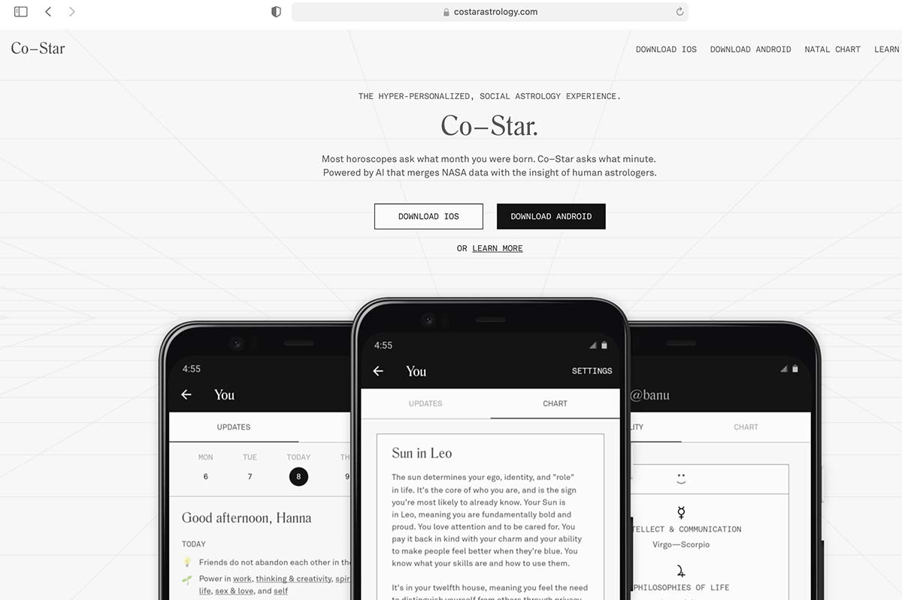
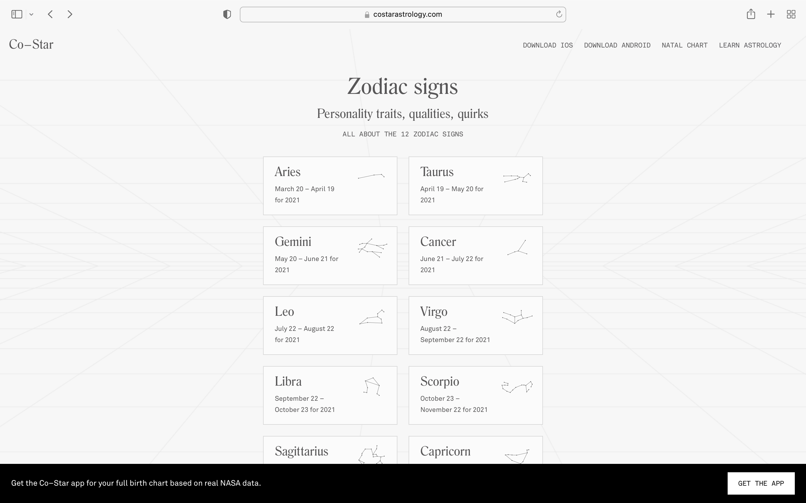
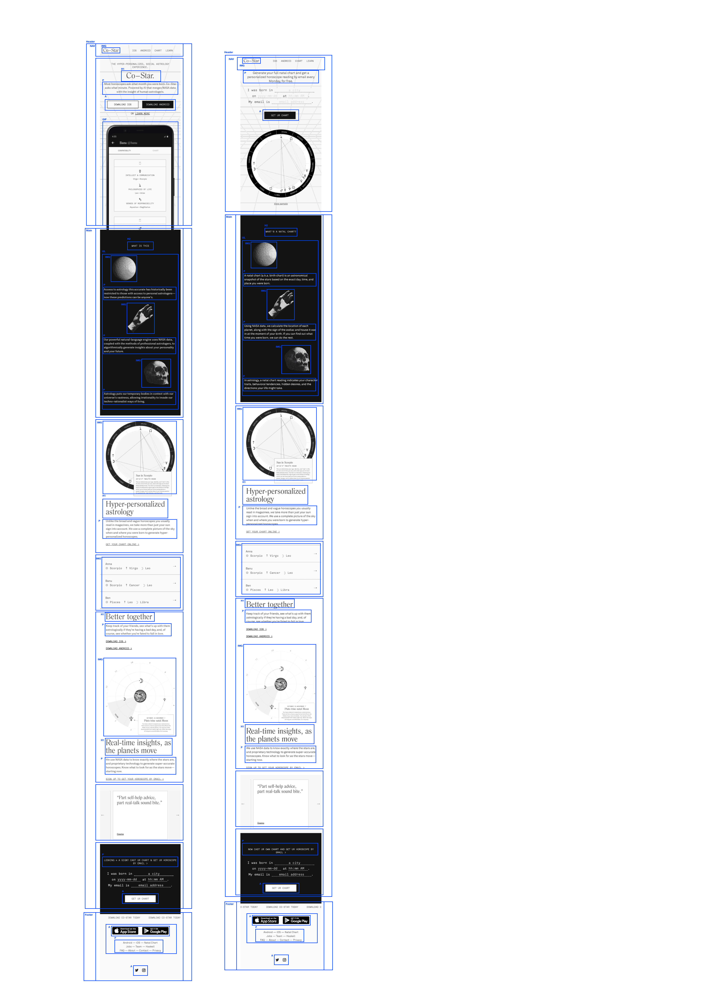
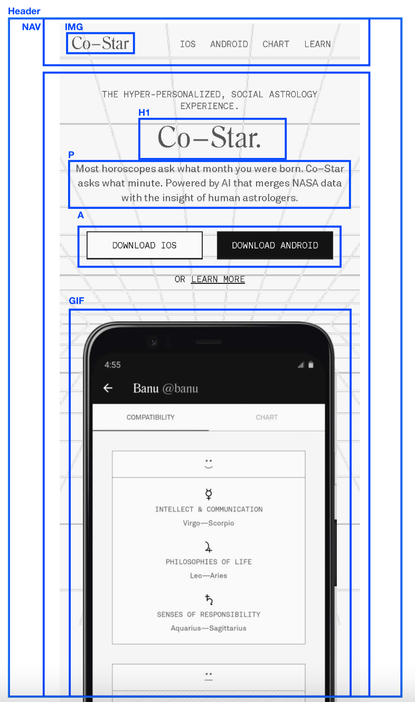
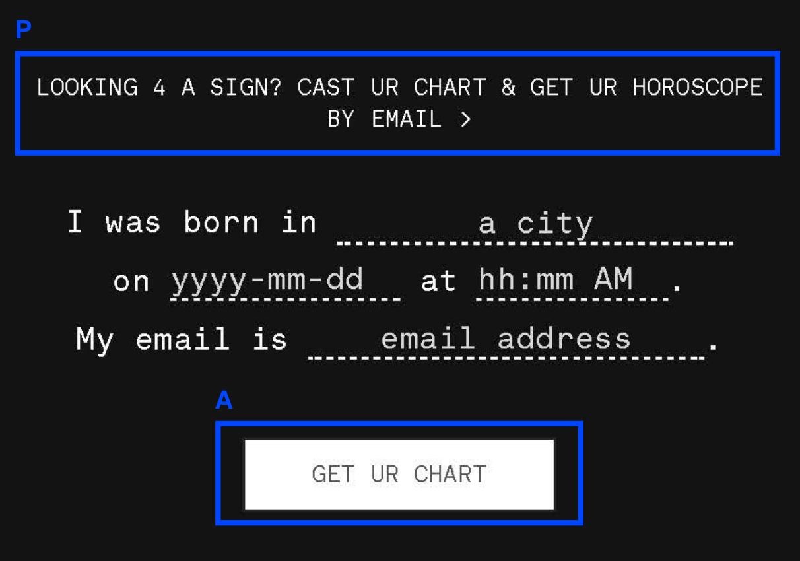
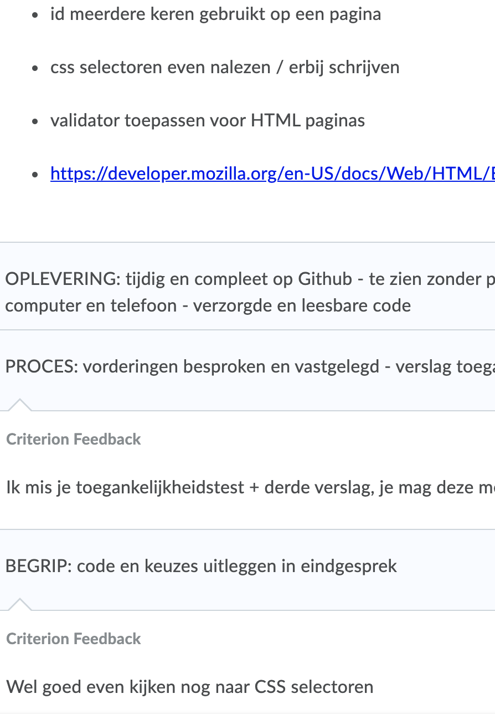

# Procesverslag
Markdown is een simpele manier om HTML te schrijven.  
Markdown cheat cheet: [Hulp bij het schrijven van Markdown](https://github.com/adam-p/markdown-here/wiki/Markdown-Cheatsheet).

Nb. De standaardstructuur en de spartaanse opmaak van de README.md zijn helemaal prima. Het gaat om de inhoud van je procesverslag. Besteedt de tijd voor pracht en praal aan je website.

Nb. Door *open* toe te voegen aan een *details* element kun je deze standaard open zetten. Fijn om dat steeds voor de relevante stuk(ken) te doen.

## Jij

uitwerken voor kick-off werkgroep

### Auteur:
Shealynn Bouman

#### Je startniveau:
Blauw

#### Je focus:
Surface plane

## Je website

uitwerken voor kick-off werkgroep

### Je opdracht:
<a href="https://www.costarastrology.com/">Bezoek Co-Star</a>

#### Screenshot(s) van de eerste pagina (small screen): 
Dit is de: Homepagina  

#### Screenshot(s) van de tweede pagina (small screen):
Dit is de: Learn pagina  

 

## Breakdownschets (week 1)

uitwerken na afloop 2e werkgroep

### de hele pagina: 

### dynamisch deel: 

### wellicht nog een dynamisch deel (bijv filter): 

## Voortgang 1 (week 2)

uitwerken voor 1e voortgang

### Stand van zaken
Ik had nog niet ontzettend veel gemaakt, maar de richting waar ik op wilde gaan, vonden de studentenassistenten goed om verder mee te gaan.

### Agenda voor meeting
samen met je groepje opstellen

| student 1      | student 2          | student 3    | student 4        |
| ---            | ---                | ---          | ---              |
| dit bespreken  | en dit             | en ik dit    | en dan ik dat    |
| en dat ook nog | dit als er tijd is | nog een punt | dit wil ik zeker |
| ...            | ...                | ...          | ...              |

### Verslag van meeting
- Ik moet proberen om divjes te vervangen met andere elementen
- Vooral verder gaan met het coderen

## Voortgang 2 (week 3)

uitwerken voor 2e voortgang

### Stand van zaken
Mijn pagina's zagen er goed uit en ik moest vooral gewoon verder gaan met coderen. 

### Verslag van meeting
hier na afloop snel de uitkomsten van de meeting vastleggen

- Gewoon verder gaan met coderen
- Ik moet proberen om mijn pagina nog wat extra te geven voor de oplevering.

## Toegankelijkheidstest (week 4)

uitwerken na test in 8e voortgang

### Bevindingen
Lijst met je bevindingen die in de test naar voren kwamen:

#### Screen reader
Door de website gaan met spraak ging goed! de buttons en linkjes waren allemaal goed geplaatst en ik kon er makkelijk doorheen gaan. 

#### Besturen
De website besturen met shock vond ik best wel lastig, maar het was wel bestuurbaar met een toetsenbord. 

#### Kleur mode (zicht)
Ik heb ervoor gekozen om dark mode niet te gebruiken, omdat de pagina zelf al in het zwart/wit is. Ik heb de pagina nu gemaakt in kleur, zodat het voor gebruikers ook wel prettig kan zijn om wat kleur te zien voor wanneer zij op de pagina ziten.

## Voortgang 3 (week 4)

uitwerken voor 3e voortgang

### Stand van zaken
De feedback ging goed. De studentenassistenten hebben mij goed geholpen. Ze hebben mij wel verteld om de meeste divjes weg te werken. 

### Verslag van meeting
hier na afloop snel de uitkomsten van de meeting vastleggen

- De achtergrond die ze op de originele pagina gebruiken, zal voor mij te moeilijjk om na te maken. 
- Gewoon doorgaan met het coderen. 

## Eindgesprek (week 5)

uitwerken voor eindgesprek

### Stand van zaken
Ik vond zelf dat het best goed ging. Ik vind coderen zelf af en toe nog wel heel lastig, maar doordat ik helemaal zelf kon kiezen welke website ik ging maken, vond ik het ook wel leuk om te doen. 

Ik vond het nog wel lastig om met JavaScript te werken, maar doordat ik iets meer ging oefenen is het wel gelukt om er mee te werken. 

### Wat moet ik nog verder uitwerken? 
1. Er mist nog een stuk JavaScript (Bijv. Dark/light mode)
2. Er mogen niet meerdere ID's op de pagina
3. De toegangkelijkheids test miste nog

### Foto van de feedback

### Screenshot(s)

hier screenshot(s) van je eindresultaat

## Bronnenlijst

continu bijhouden terwijl je werkt

Nb. Wees specifiek ('css-tricks' als bron is bijv. niet specifiek genoeg).

1. https://way2tutorial.com/html/marquee_generator.php
2. https://www.w3schools.com/tags/att_input_type_date.asp
3. https://www.w3schools.com/tags/att_input_type_date.asp
4. https://way2tutorial.com/html/marquee_generator.php
5. https://www.w3schools.com/howto/howto_js_toggle_dark_mode.asp

